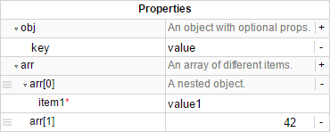

# react-property-grid

A react/redux implementation of hierarchical, editable property grid, backed by JSON Schema.

Heavily inspired by [Treema](http://codecombat.github.io/treema/), this React component takes a [JSON Schema](https://spacetelescope.github.io/understanding-json-schema/) and optional default JSON data to provide a powerful and performant hierarchical grid dynamically.

This project is a WIP: some important features are not there yet, but hopefully they will soon!



## Installation

```
npm install --save react-property-grid
```

## Usage

```javascript
import React from 'react'
import ReactDOM from 'react-dom'

ReactDOM.render(
  <PropertyGrid schema={schema} />,
  document.getElementById('property-grid')
)
```

### Options

| Name     | Description | Default |
|----------|-------------|---------|
| schema   | A valid [JSON Schema](https://spacetelescope.github.io/understanding-json-schema/) | `{"$schema": "http://json-schema.org/draft-04/schema#", "properties": {"hello": {"type": "string"}}}` |
| data     | Optional default JSON data                   | `{"hello": "world"}`                   |
| title    | Optional header title string                 | `"Properties"`                         |
| onChange | Optional callback executed when data changes | `function(data) { console.log(data) }` |

## To do

- Fields validation
- Selection from `anyOf` list when adding an item (now it's auto-selecting the first one)
- Handle `allOf` properties
- More useful description on caption row

## Contributing

1. Fork it!
2. Create your feature branch: `git checkout -b my-new-feature`
3. Commit your changes: `git commit -am 'Add some feature'`
4. Push to the branch: `git push origin my-new-feature`
5. Submit a pull request :D

## Credits

Thanks to [Irion](http://www.irion.it/) for financing this project and contributing to it!

## License

[The MIT License (MIT)](https://github.com/codecombat/treema/blob/master/LICENSE)
